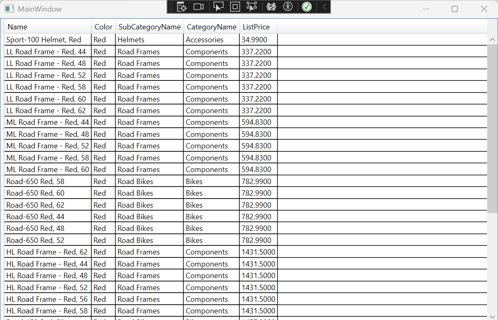
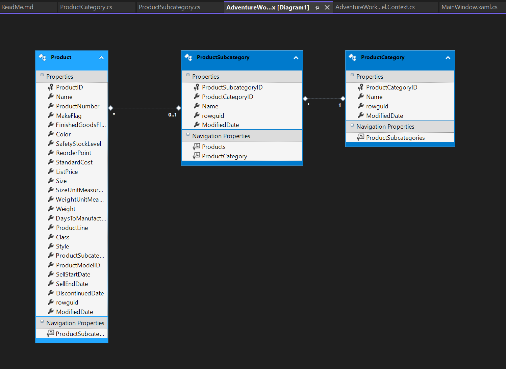
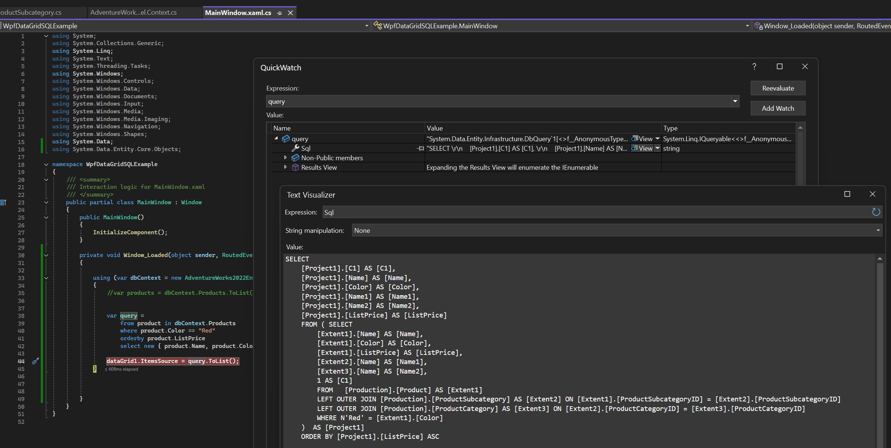
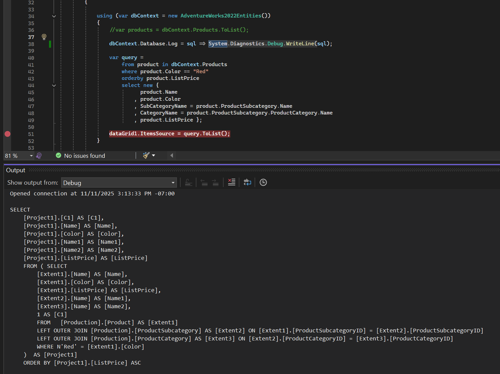

# Walkthrough: Display data from a SQL Server database in a DataGrid control

Based on Microsoft turtorial:

[https://learn.microsoft.com/en-us/dotnet/desktop/wpf/controls/walkthrough-display-data-from-a-sql-server-database-in-a-datagrid-control](https://learn.microsoft.com/en-us/dotnet/desktop/wpf/controls/walkthrough-display-data-from-a-sql-server-database-in-a-datagrid-control)

It uses AdventureWorks sample database:

Better restore it from backup:
[https://github.com/Microsoft/sql-server-samples/releases/tag/adventureworks](https://github.com/Microsoft/sql-server-samples/releases/tag/adventureworks)

Or from SQL script, but where is the data?
[https://github.com/Microsoft/sql-server-samples/releases](https://github.com/Microsoft/sql-server-samples/releases)

Application will look like this:

It use data diagram:

LINQ to SQL is visible in Debug mode:

Steps:
1. Create WPF app.
2. Restore database from backup.
3. Install EntityFramework 6.5.1 (if you will do it todgether with creation Data Model EDMX, you may run into error.)
5. Add ADO.NET Entity Data Model (EDMX), select Product and ProductCategory tables for it.
6. Bind SQL result to grid.  
7. Use DB context logging to get SQL generated by LINQ.

# Errors I got while work on it:
Package Installation Error
Could not add all required packages to the project. The following packages failed to install from 'C:\Program Files (x86)\Microsoft Visual Studio\Shared\Entity Framework Tools\NuGet Packages': 
EntityFramework.6.2.0 : Unable to find version '6.2.0' of package 'EntityFramework'.

I fixed it by installing EF v6.5.1 